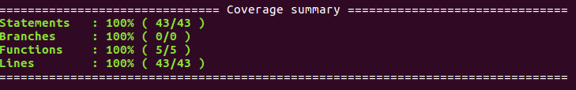

# Test-coverage

**B.Why is test coverage useful?**

1.It can assure the quality of test.

2.It can help identify what portions of the code were actually touched for the release or fix.

3.It can help to determine the paths in your application that were not tested.

4.Prevent Defect leakage.

5.Time, scope and cost can be kept under control.

6.Defect prevention at an early stage of project life cycle.

7.It can determine all the decision points and paths used in the application, which allows you to increase test coverage.

8.Gaps in requirements, test cases and defects at unit level and code level can be found in an easy way.

What Test Coverage does?

1.Finding area of a requirement not implemented by a set of test cases
2.Helps to create additional test cases to increase coverage
3.Identifying a quantitative measure of test coverage, which is an indirect method for quality check
4.Identifying meaningless test cases that do not increase coverage

### What are Istanbul and nyc?
##### Istanbul - a JS code coverage tool written in JS. It computes statement, line, function and branch coverage. with module loader hooks to transparently add coverage when running tests. Supports all JS coverage use cases including unit tests, server side functional tests and browser tests.

##### Features:
* Well-tested on node (prev, current and next versions) and the browser (instrumentation library only).
* Can be used on the command line as well as a library.
*
##### > Getting started
`$ npm install -g istanbul`

##### > To see it in action
Say you have a test script test.js that runs all tests for your node project without coverage.

Simply:

`$ cd /path/to/your/source/root`

`$ istanbul cover test.js`

  

and this should produce a `coverage.json,` `lcov.info` and `lcov-report/*html` under `./coverage`

##### The command line
`$ istanbul help`

gives you detailed help on all commands.

Why the funky name?

Since all the good ones are taken.
 Comes from the loose association of ideas across coverage, carpet-area coverage, the country that makes good carpets and so on...
